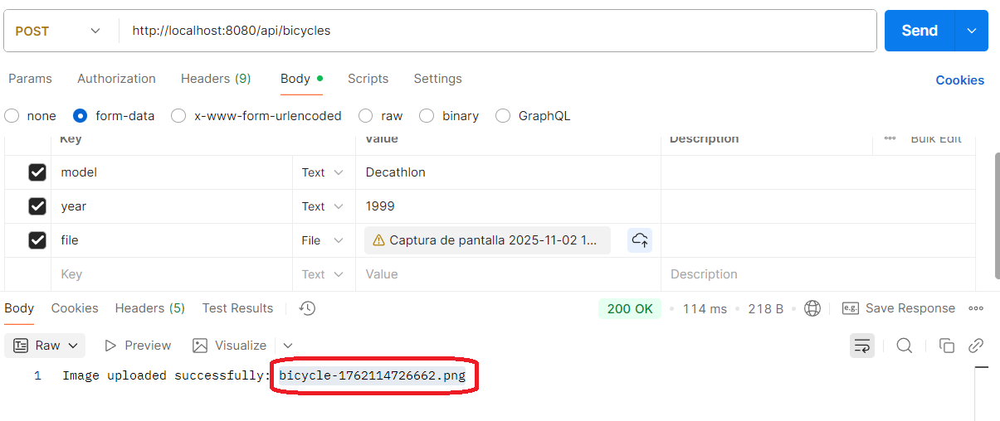
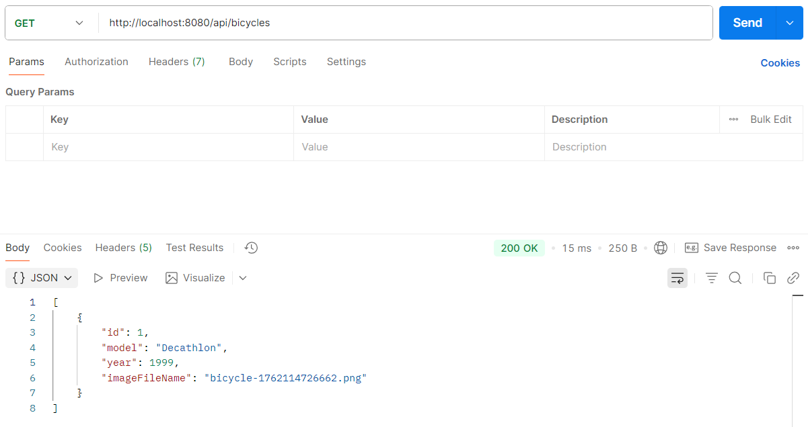
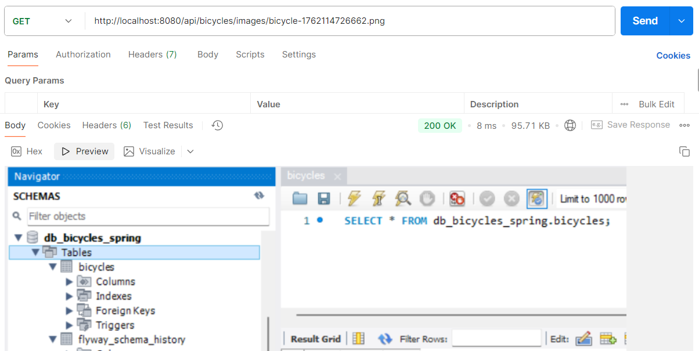

# Image upload/download (Spring Boot + MySQL)

It's just that... Just showing how to do end points to upload/download images using Spring boot.

## Getting Started

For the initial steps give a try to my following video for the basics of Spring:
https://www.youtube.com/watch?v=DvzGf0cAlg4

It's a step by step guide to understand how to make a Spring project implementing RESTFul and JPA accessing MySQL.

For this project please read the links at the bottom of this README.md file.

### For the most impatient learners

Clone this project:

````
git clone https://github.com/tcrurav/spring-boot-image-upload-download.git
````

Open the backend with Eclipse and change the backend/src/main/resources/application.properties according to your database credentials.

Create a database with your credentials using for instance MySQL Workbench.

Now you can start your backend project.

Now you can do a post to upload an image like this:



After uploading you can do a get to see all images. In this case just the image uploaded above:



And now you can just get the image using as param the name of the image in the above end-point result:



Enjoy!!!

### Prerequisites

All you need is... some time and...
* Eclipse IDE.
* STS 4, installed through the Eclipse Marketplace.
* MySQL Workbench, to host the database also included in the project.
* More hours than you first could think of...

## Built With

* [Eclipse IDE](https://www.eclipse.org/ide/) - The IDE used
* [Maven](https://maven.apache.org/) - Dependency Management
* [Spring Tools 4](https://spring.io/tools) - The framework used
* [MySQL Workbench](https://www.mysql.com/products/workbench/) - The Database used

## Acknowledgments

* https://medium.com/@dulanjayasandaruwan1998/uploading-images-in-a-spring-boot-project-a-step-by-step-guide-8a55248ea520. Uploading Images in a Spring Boot Project: A Step-by-Step Guide 